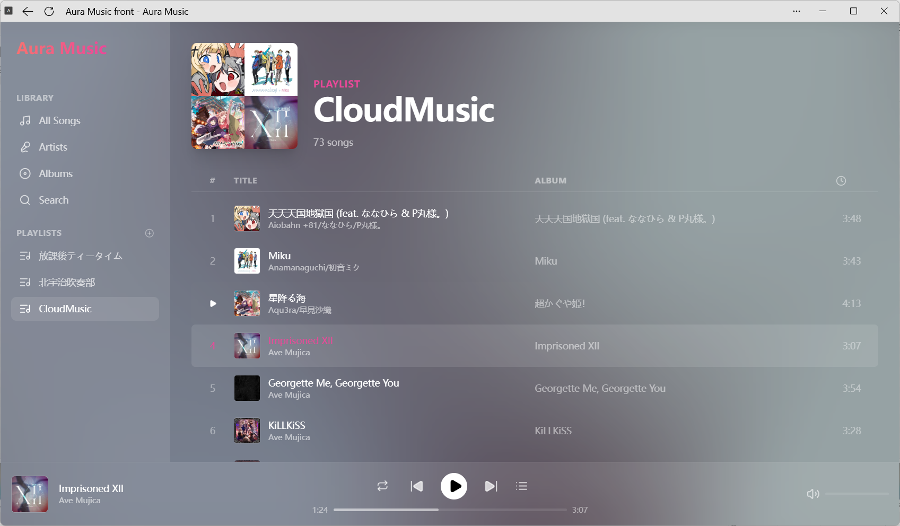
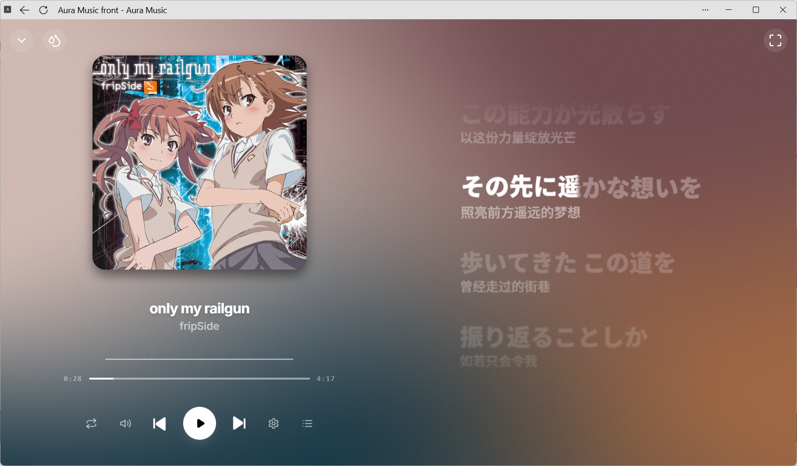
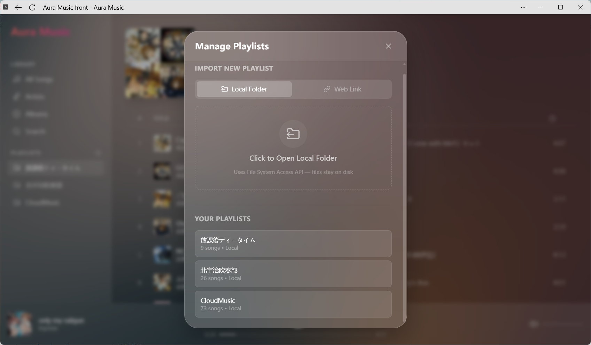

<div align="center">

# 🎵 Aura Music

**一个高颜值的在线音乐播放器，支持本地文件播放与网易云歌单导入**

[](https://react.dev)
[](https://vitejs.dev)
[](https://www.typescriptlang.org)
[](./LICENSE)

**👉 [在线体验](https://kitaki-ciallo.github.io/aura-music-homelab/) · [后端版本部署指南](./DEPLOYMENT.md)**

</div>

---

## 🌟 项目简介

Aura Music 是一个现代化的网页音乐播放器，提供沉浸式的听歌体验。你可以直接通过浏览器 **[在线使用](https://kitaki-ciallo.github.io/aura-music-homelab/)**，无需安装任何软件。

> 💡 **推荐将其作为 PWA 应用安装到桌面**，获得接近原生应用的体验。在 Chrome / Edge 中访问在线地址后，点击地址栏右侧的「安装」按钮即可。

### 两个版本

| | 🌐 纯前端版本 (Frontend_only) | 🖥️ 后端版本 (Backend-version) |
|---|---|---|
| **分支** | `Frontend_only`（默认） | `Backend-version` |
| **适用场景** | 在线体验、个人桌面使用 | NAS / 家庭服务器部署 |
| **音频来源** | 浏览器 File System Access API 读取本地文件 | 后端直接读取服务器/NAS 上的音乐目录 |
| **歌词 & 封面** | 自动从网易云匹配并缓存到 IndexedDB | 自动抓取并持久化到本地 Sidecar 文件 |
| **需要后端** | ❌ 不需要 | ✅ Node.js + Nginx(容器化部署开发中) |

---

## ✨ 功能亮点

- 🎨 **WebGL 流体背景** — 基于 [Shadertoy](https://www.shadertoy.com/view/wdyczG) 的动态着色器背景，自动从封面提取配色，切歌时平滑过渡
- 🎤 **逐字歌词 (YRC)** — 支持网易云逐字精确时间轴 + LRC 滚动歌词 + 翻译歌词三层显示
- 📂 **本地文件夹导入** — 基于 [File System Access API](https://developer.mozilla.org/en-US/docs/Web/API/File_System_Access_API)，文件保留在磁盘上，不上传不复制
- 🔗 **网易云歌单导入** — 粘贴网易云歌单链接即可导入，自动匹配歌词和封面
- 🔎 **全局搜索** — 支持本地曲库搜索 + 网易云在线搜索
- 💾 **IndexedDB 持久化** — 播放队列、歌单、目录权限自动保存，刷新不丢失
- 🌓 **多主题切换** — Dark / Light / Fluid（毛玻璃）三种视觉风格
- ⌨️ **快捷键** — 空格播放/暂停、方向键切歌、音量调节等
- 📱 **PWA 支持** — 可安装为桌面/移动应用，离线可用

---

## 📸 截图预览

<div align="center">


<br/>
<em>歌单列表 — 支持导入本地文件夹与网易云歌单</em>
<br/><br/>


<br/>
<em>全屏播放 — WebGL 流体背景 + 逐字歌词同步显示</em>
<br/><br/>


<br/>
<em>导入面板 — 导入本地文件夹或粘贴网易云歌单链接</em>

</div>

---

## 📖 使用指南

### 导入本地音乐

1. 点击侧边栏底部的 **"+"** 按钮打开导入面板
2. 选择 **Local Folder** 标签
3. 选择包含音频文件的文件夹（支持 MP3、FLAC、WAV、M4A、OGG 等格式）
4. 子文件夹会自动创建为独立的歌单
5. 系统会自动从网易云匹配歌词和封面，并缓存到 IndexedDB

<details open>
<summary>📹 <strong>查看演示视频 — 导入本地音乐</strong></summary>
<br/>

https://github.com/user-attachments/assets/621ec526-1a98-413a-b9f3-b9c4d5cb5681

> 视频演示了如何通过侧边栏导入本地音乐文件夹，系统自动识别音频文件并匹配歌词与封面。

</details>

### 切换主题

Aura Music 提供三种视觉主题，满足不同场景的使用需求：

| 主题 | 说明 |
|------|------|
| 🌑 **Dark** | 深色模式，适合夜间使用，低蓝光护眼 |
| ☀️ **Light** | 浅色模式，适合日间使用，清爽明亮 |
| 🫧 **Fluid** | 毛玻璃模式，搭配 WebGL 流体背景，最具沉浸感 |

**切换方式**：点击播放器界面中的 ⚙️ 设置按钮，在主题选项中选择即可。

<details open>
<summary>📹 <strong>查看演示视频 — 切换主题</strong></summary>
<br/>

https://github.com/user-attachments/assets/55312e41-20eb-4ef8-a5cf-a3326bd5b277

> 视频演示了在 Dark、Light、Fluid 三种主题之间切换的效果。

</details>

### 导入网易云歌单

1. 选择 **Web Link** 标签
2. 粘贴网易云歌单链接（如 `https://music.163.com/playlist?id=123456`）
3. 点击 **Import**，歌曲会以在线流媒体方式播放

### Sidecar 元数据文件

在音频文件旁放置同名 `.json` 文件可覆盖自动匹配的元数据：

```
music/
├── Artist - Title.flac
└── Artist - Title.json    ← Sidecar 元数据
```

JSON 格式参考：

```json
{
  "lrc": "[00:10.16] 歌词内容...",
  "yrc": "[10500,4880](10500,880,0)逐(11380,970,0)字...",
  "tLrc": "[00:10.16] 翻译内容...",
  "metadata": ["作词: xxx", "作曲: xxx"],
  "coverUrl": "https://example.com/cover.jpg"
}
```

### 快捷键

| 快捷键 | 功能 |
|--------|------|
| `Space` | 播放 / 暂停 |
| `←` / `→` | 上一首 / 下一首 |
| `↑` / `↓` | 音量 +/- |
| `Ctrl + F` | 打开搜索 |
| `L` | 切换歌词显示 |

---

## 🚀 本地部署

### 前置要求

- **Node.js** ≥ 18
- **Chrome / Edge**（需要 File System Access API 支持）

### 纯前端版本

```bash
# 1. 克隆仓库
git clone https://github.com/kitaki-Ciallo/aura-music-homelab.git
cd aura-music-homelab
git checkout Frontend_only

# 2. 安装依赖
npm install

# 3. 启动开发服务器
npm run dev
```

打开 `http://localhost:3000`，点击侧边栏 **"+"** 按钮导入本地音乐文件夹即可开始使用。

#### 构建生产版本

```bash
npm run build
```

生成的 `dist/` 文件夹可直接部署到任何静态托管服务（Cloudflare Pages、Vercel、Nginx 等）。

---

## 🖥️ 后端版本 (Backend-version)

> **推荐部署到 NAS 或家庭服务器**，直接播放 NAS 中的歌曲，无需通过浏览器导入。

后端版本位于 [`Backend-version`](https://github.com/kitaki-Ciallo/aura-music-homelab/tree/Backend-version) 分支，相比纯前端版本增加了以下能力：

- 📁 **服务端音乐目录扫描** — 后端直接读取指定目录下的所有音频文件，客户端无需手动导入
- 🎤 **歌词元数据自动抓取** — 自动从网易云匹配歌词、封面等元数据，并以 Sidecar JSON 文件的形式持久化到音乐目录
- 🌐 **局域网/公网访问** — 通过 Nginx 反向代理，家中任何设备都可以访问

### 部署方式

后端版本的详细部署步骤（包括 Node.js 后端、Nginx 配置、SSL 证书等）请参阅：

**👉 [部署指南 (DEPLOYMENT.md)](./DEPLOYMENT.md)**

**快速概览**：

```bash
# 1. 克隆并切换到后端分支
git clone https://github.com/kitaki-Ciallo/aura-music-homelab.git
cd aura-music-homelab
git checkout Backend-version

# 2. 安装依赖并构建前端
npm install
npm run build

# 3. 启动后端服务 (使用 PM2)
export MUSIC_DIR=/path/to/your/nas/music
export PORT=3002
pm2 start server/index.js --name aura-music-server
```

---

## 🏗️ 架构

```
┌──────────────────────────────────────────────┐
│                  Browser                      │
│                                              │
│  ┌─────────┐  ┌───────────┐  ┌────────────┐ │
│  │ React   │  │ IndexedDB │  │ Web Worker │ │
│  │ App     │◄─┤ (idb-     │  │ (WebGL     │ │
│  │         │  │  keyval)  │  │  Renderer) │ │
│  └────┬────┘  └───────────┘  └────────────┘ │
│       │                                      │
│  ┌────▼────────────────────────────────────┐ │
│  │  File System Access API                 │ │
│  │  (Local audio files stay on disk)       │ │
│  └─────────────────────────────────────────┘ │
│       │                                      │
│  ┌────▼────────────────────────────────────┐ │
│  │  Netease Cloud Music API (外部)         │ │
│  │  • 歌词搜索 & 匹配 (LRC/YRC/翻译)      │ │
│  │  • 封面获取                              │ │
│  │  • 歌单导入                              │ │
│  └─────────────────────────────────────────┘ │
└──────────────────────────────────────────────┘
```

> **纯前端版本**：无需后端服务，所有数据存储在浏览器 IndexedDB 中，音频文件通过 File System Access API 从本地磁盘读取。

## 🛠️ 技术栈

| 技术 | 用途 |
|------|------|
| [React 19](https://react.dev) | UI 框架 |
| [Vite 6](https://vitejs.dev) | 构建工具 |
| [TypeScript](https://www.typescriptlang.org) | 类型安全 |
| [Tailwind CSS](https://tailwindcss.com) | 样式系统 |
| [idb-keyval](https://github.com/nicedoc/idb-keyval) | IndexedDB 封装 |
| [Lucide React](https://lucide.dev) | 图标库 |
| [React Router](https://reactrouter.com) | 路由 |
| WebGL / GLSL Shaders | 流体背景渲染 |
| Web Worker | 后台 WebGL 渲染 & 颜色提取 |
| File System Access API | 本地文件访问 |

## 📄 License

[MIT](./LICENSE)

---

> Shader source: https://www.shadertoy.com/view/wdyczG

> Vibe coding with gemini3-pro, gpt-5.1-codex-mini, and claude-sonnet-4.5.
